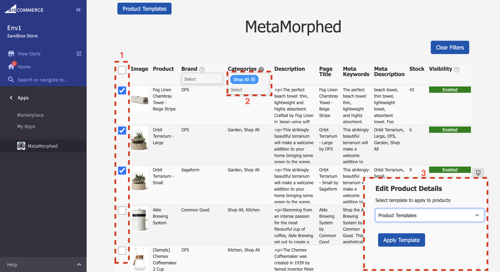
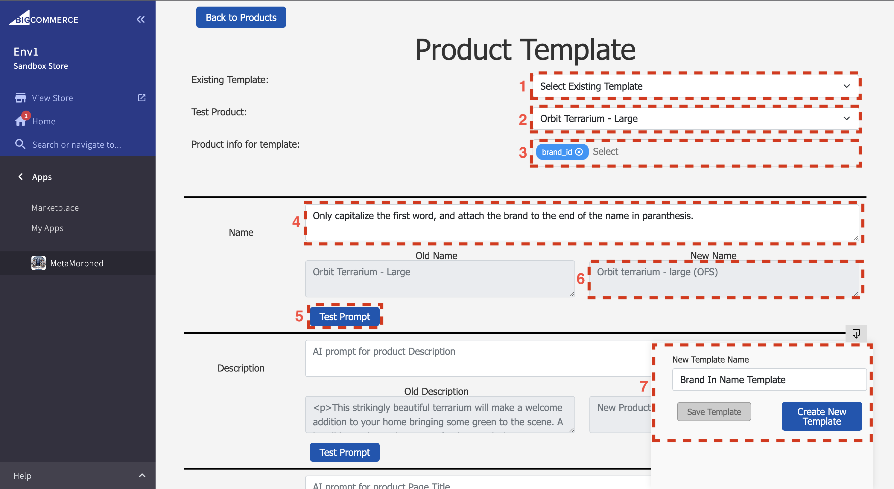

METAMORPHED:

Purpose:
    To let BigCommerce users bulk edit their products using prompts and AI, 
    allowing users to easily change incoming product formats to match their own store

Primary Page

    Features:
        1. Select one, multiple, or all products
        2. Multi-Select-Search Filtering
        3. Collapsible sticky tab for updated products 
        
Templates Page

    Features:
        1. Select preexisting template to populate forms (Optional)
        2. Select product to use as tester for prompts
        3. Select any product details you want your prompts to have access to
        4. Form for entering prompt for editing product info
        5. Submit button to see example output from prompt
        6. Location for seeing example output
        7. Collapsible sticky tab for saving or creating templates

THINGS TO ADD/IMPROVE:

    Internet Access:
        - With ChatGPT4's new ability to access the internet, this feature could be used to 
        find the products online or comparable products, and create more accurate data

    Description:
        - For creating new description, BigCommerce often formats the descriptions with HTML 
        tags, and chatGPT sometimes removes those tags if not specifically told to keep them. 
        - For displaying the descriptions, would like to have the descriptions formatted 
        according to the html tags, but am having issue with react-html-parser, and don't 
        want to use dangerouslySetInnerHTML.

    Variants:
        - Initially had the ability to display/edit variants, but was unneccesary and 
        cluttered page, so was removed.

    Hosting APP:
        - App is only being hosted locally, though it was designed so it could be hosted online.
        This is because this app's main function was to assist a friend, which can be achieved 
        through local use. Additionally, I don't want to expose my OpenAPI key to potential spam 
        requests. To resolve this, I have to charge users to use the app

    Charging Users
        - If I were to charge users, I would most likely use a pay-as-you-go method, so that 
        users only pay for what they use, and I remove any burden of responsibility of payment 
        from myself.

    Selecting OpenAPI Model:
        - Charging users would also allow me to add the option for users to select which model 
        of OpenAPI they want to use, potentially providing better product information, but 
        costing the user more. 
